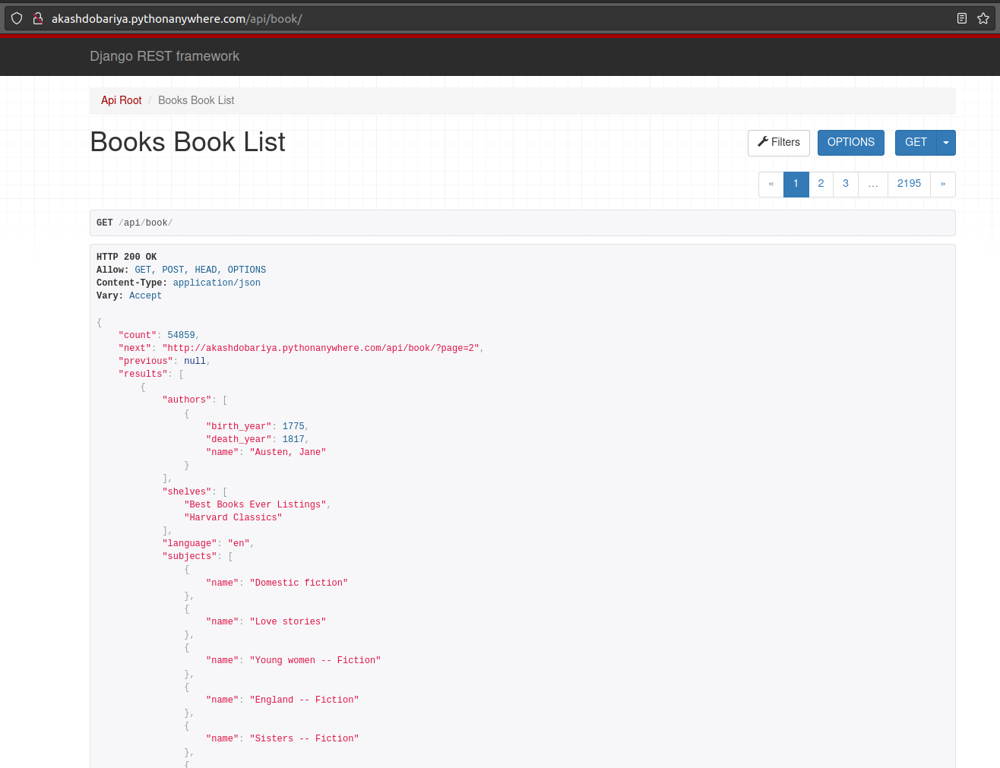

# Online Demo
Visit [The Website](http://akashdobariya.pythonanywhere.com/api/book/) to check the API data online



# Setup
Get Project from Git
```sh
git clone https://github.com/akashdobariya2702/bookstore.git
```

# Installation and Run Server
This will setup virtual environment, install packages and run the server using `settings.py` file
```sh
source dj_run.sh
```

# Now you can test website
Open http://127.0.0.1:8000/api/book/ URL in the brower (ex. Chrome)

You can filter data by
```sh
/api/book/?book_id=1260
/api/book/?language=en,fr
/api/book/?mime_type=pdf
/api/book/?topic=Social
/api/book/?author=Thoreau
/api/book/?topic=child, infant
```
